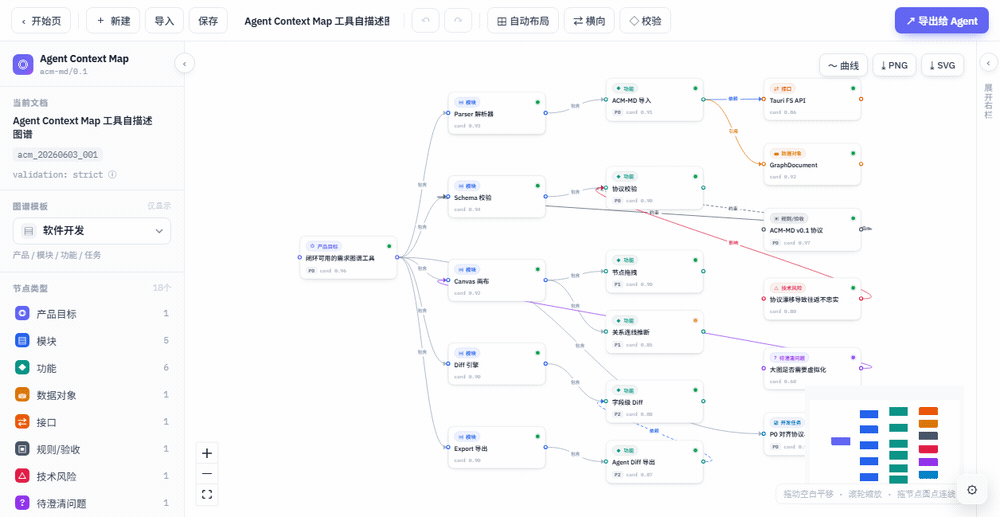
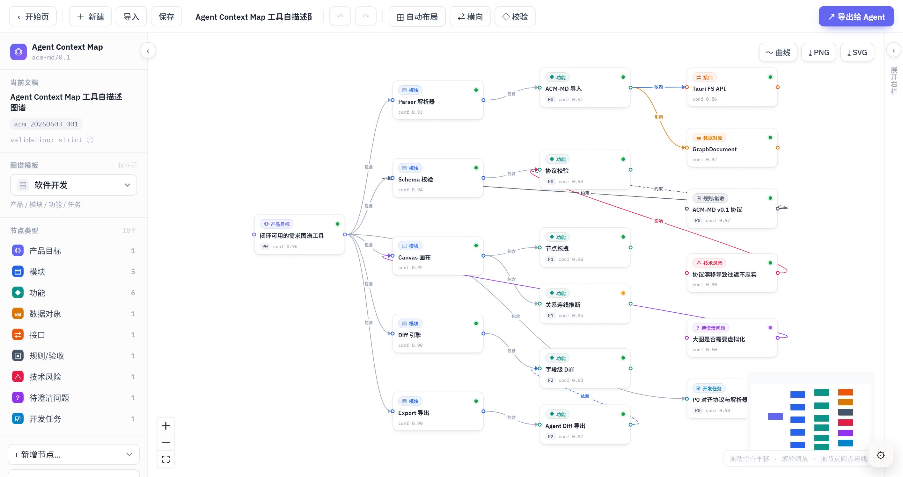
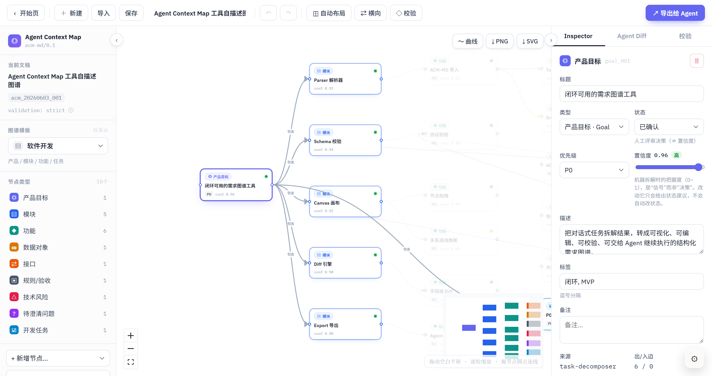
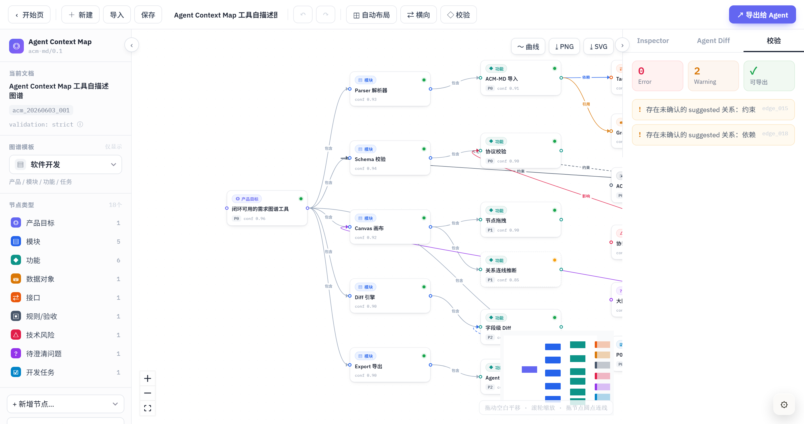
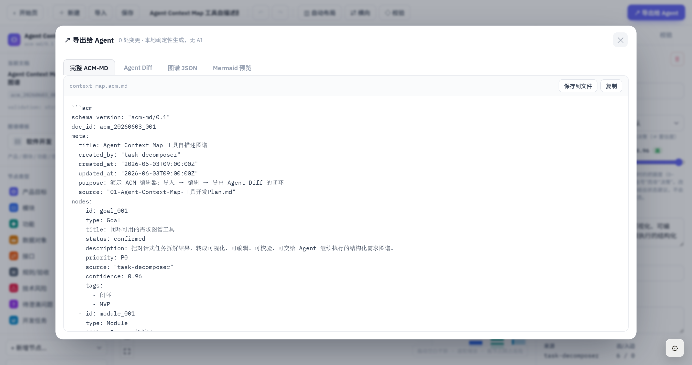
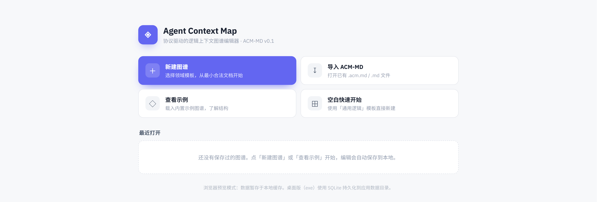

<div align="center">

# Agent Context Map

**协议驱动的 Agent 需求图谱编辑器** · 把任务拆解、需求澄清和协作上下文变成可视化、可编辑、可校验、可导出的结构化图谱。


</div>

Agent Context Map（ACM）是一个本地运行的 Agent 需求图谱编辑器。它把对话式任务拆解结果整理成可视化、可编辑、可校验、可导出的结构化上下文，让后续 Agent 可以更清楚地理解目标、约束、模块、功能和执行关系。

项目基于 `ACM-MD v0.1` 协议构建，使用 Vite + React + React Flow 实现，并可通过 Tauri 打包为绿色版桌面应用，适合用于需求澄清、任务拆解、Agent 协作交接和复杂项目上下文管理。



> 拖动节点实时跟手 · 一键自动布局 · 选中即可逐节点编辑 · 一键导出 ACM-MD / Agent Diff / Mermaid

完整编辑器界面：



## 界面预览

<table>
  <tr>
    <td width="50%"></td>
    <td width="50%"></td>
  </tr>
  <tr>
    <td align="center"><b>Inspector · 逐节点编辑</b><br/>类型、状态、优先级、置信度、标签与来源一目了然</td>
    <td align="center"><b>校验 · 一键体检</b><br/>悬空边、重复 ID、未确认关系等问题实时汇总</td>
  </tr>
  <tr>
    <td width="50%"></td>
    <td width="50%"></td>
  </tr>
  <tr>
    <td align="center"><b>导出给 Agent</b><br/>完整 ACM-MD / Agent Diff / 图谱 JSON / Mermaid 预览</td>
    <td align="center"><b>开始页</b><br/>新建、导入、查看示例，编辑自动保存到本地</td>
  </tr>
</table>

## 核心能力

- 可视化编辑 Agent 需求图谱，支持节点拖拽、画布平移、缩放和关系连线。
- 支持目标、模块、功能、约束、资源、风险、交付物等节点类型。
- 连线时根据节点类型推断关系，并区分建议关系与已确认关系。
- 实时生成 Agent Diff，记录字段变更、布局变更和给后续 Agent 的执行提示。
- 内置校验规则，可检查悬空边、重复 ID、未确认关系、缺少归属模块等问题。
- 支持导出完整 ACM-MD、Agent Diff、图谱 JSON 和 Mermaid 预览。
- 内置自描述示例图谱，用这个工具自身的需求作为演示数据。

## 本地运行

```bash
npm install
npm run dev
```

开发服务器默认运行在：

```text
http://localhost:5173
```

生产构建：

```bash
npm run build
npm run preview
```

## 目录结构

```text
index.html
package.json
vite.config.js
src/
  main.jsx
  App.jsx
  acm/
    Canvas.jsx
    Panels.jsx
    TweaksPanel.jsx
    data.js
doc/
  01-Agent-Context-Map-工具开发/
  02-任务拆解大师改造/
  03-ACM-MD格式规范指导文件.md
```

## 协议说明

ACM-MD 是本项目的核心数据契约。它用 Markdown + YAML 结构描述 Agent 任务上下文，包括：

- 项目目标与范围
- 节点清单
- 节点之间的关系
- 校验结果
- Agent 可继续执行的上下文差异

详细规范见：

```text
doc/03-ACM-MD格式规范指导文件.md
```

## 技术栈

- React 18 + Vite 5
- React Flow（@xyflow/react）画布与连线
- Dagre 自动布局、html-to-image 画布导出
- Tauri 2 桌面打包（绿色版 exe，SQLite 本地持久化）
- 原生 CSS / 内联样式，纯前端本地状态管理

## 适用场景

- 把模糊想法拆成结构化需求图谱
- 为 Agent 编排任务上下文
- 审阅复杂需求中的目标、约束、风险和交付物
- 在多 Agent 协作前建立统一的上下文地图

## 备注

本项目是纯本地前端应用，不依赖后端服务。当前版本主要面向原型验证和协议沉淀，后续可以扩展为更完整的任务拆解、上下文审阅和 Agent 工作流编排工具。
